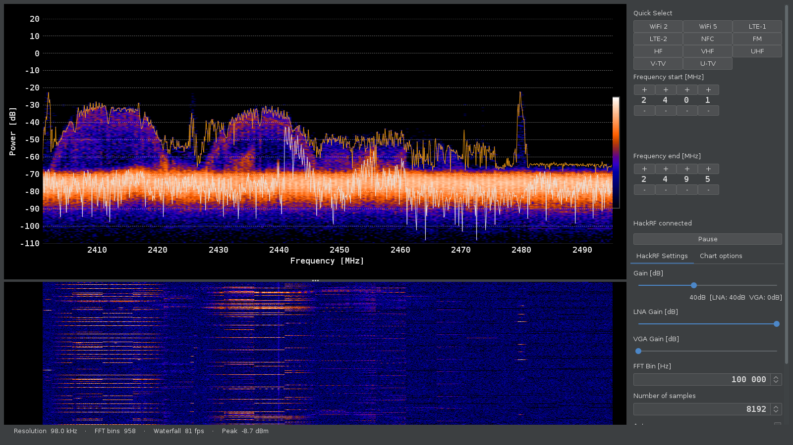
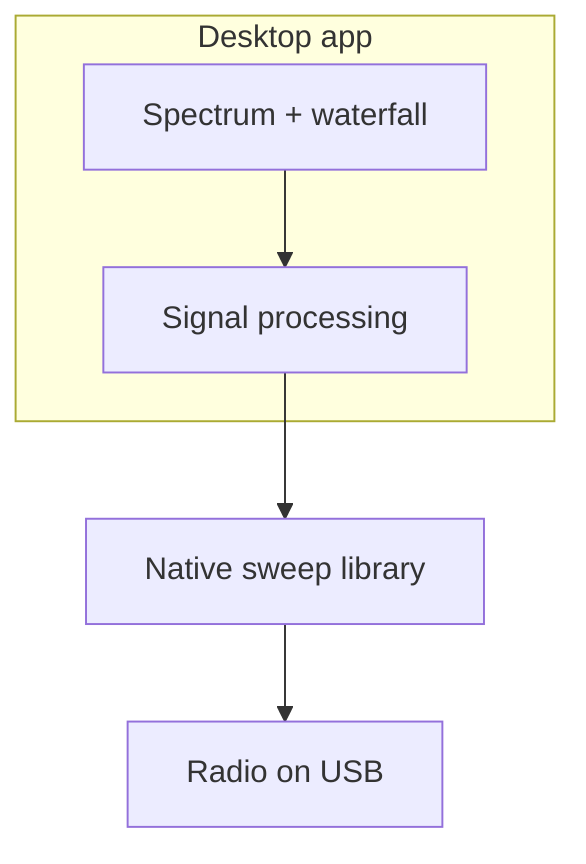

# Spectrum Analyzer

[](https://github.com/chris-piekarski/hackrf-spectrum-analyzer/releases/latest)
[](LICENSE)
[](docs/building.md)
[](docs/hackrf-setup.md)
[](docs/hackrf-setup.md)
[](docs/building.md)
[](https://github.com/chris-piekarski/hackrf-spectrum-analyzer/commits/master)

Live spectrum and waterfall for a HackRF on the USB port.



This is a maintained fork of [pavsa/hackrf-spectrum-analyzer](https://github.com/pavsa/hackrf-spectrum-analyzer) with:

- **Quick Select** buttons for common bands (Wi‑Fi, LTE, FM, TV, NFC, amateur 6m/2m/70cm/33cm)
- Unit tests on the signal-processing path
- A `make`-driven build (`make help`, `make start`, `make test`)
- Antenna LNA (+14 dB) control

## What it does

- Sweeps a frequency range and draws the live spectrum plus a waterfall
- Changing a setting retunes automatically
- Peak hold, persistent display, spur filter
- EU and USA allocation overlays
- Bias-tee (antenna power) and the onboard +14 dB LNA
- Shows the attached radio’s board, serial, and firmware in the sidebar

## Quick Start

```bash
git clone --recurse-submodules https://github.com/chris-piekarski/hackrf-spectrum-analyzer.git
cd hackrf-spectrum-analyzer
make help          # all commands
make deps          # Ubuntu/Debian build packages
make start         # build if needed, then launch
```

Plug in the radio first. On Linux, run `make udev` once so the USB device stays writable. Full walkthrough: [docs/getting-started.md](docs/getting-started.md).

### How it is put together



## Documentation

- [Getting Started](docs/getting-started.md)
- [Building](docs/building.md)
- [Development & Testing](docs/development.md)
- [Radio setup](docs/hackrf-setup.md) (udev, firmware, Windows drivers)
- [Usage](docs/usage.md)
- [Architecture](docs/architecture.md)
- [Repository stats](docs/stats.md) (`make stats`)
- [Contributing](docs/contributing.md)

## Requirements

- A HackRF (One or compatible) with firmware **v2024.02.1** or newer. This app is built against host SDK **v2026.01.3**.
- Java 21+ with a display (not a headless JRE)

Building also needs Maven and a C toolchain — see [building.md](docs/building.md).

## Common commands

```bash
make help      # colorized list
make test      # unit tests (no radio required)
make lint      # compile check
make stats     # refresh docs/stats.md
make mermaid   # parse-check diagrams
make start     # launch
make mcp       # launch with local MCP (127.0.0.1:8765)
make info      # what is plugged in
```

## Testing

Unit tests cover the core processing path and do not need a radio.

```bash
make test
```

Coverage is written with JaCoCo.

## License

GPLv3

## Acknowledgments

- Original work by pavsa and contributors
- Great Scott Gadgets / the HackRF project
- People using this for real RF work

---

For AI agents and automated contributors, see [AGENTS.md](AGENTS.md).
