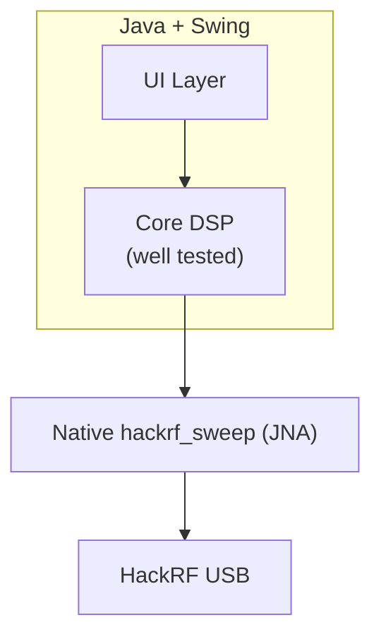

# Spectrum Analyzer GUI for hackrf_sweep

[](https://www.gnu.org/licenses/gpl-3.0)

A focused, high-performance spectrum analyzer GUI for the HackRF One.


This is a maintained fork of [pavsa/hackrf-spectrum-analyzer](https://github.com/pavsa/hackrf-spectrum-analyzer) with:

- **Quick Select** frequency band buttons (WiFi, LTE, FM, HF/VHF/UHF, TV, NFC, etc.)
- Significantly expanded unit test coverage on the core DSP logic
- Modernized build system with convenient `make` targets
- Support for the HackRF Antenna LNA (+14 dB)

## Features

- Optimized exclusively for using a HackRF as a spectrum analyzer
- All parameter changes automatically restart the sweep
- Peak hold, persistent display, and high-resolution waterfall
- Spur filter
- EU + USA frequency allocation overlays
- Antenna power (bias tee) and LNA amplifier control
- `hackrf_sweep` integrated as a shared library for performance

## Quick Start

```bash
git clone --recurse-submodules https://github.com/chris-piekarski/hackrf-spectrum-analyzer.git
cd hackrf-spectrum-analyzer
make help          # See all available commands
make deps          # Install build dependencies (Ubuntu/Debian recommended)
make start         # Build (if needed) + launch the Linux app
```

See the [documentation](docs/) for full details.

### High-Level Architecture



## Documentation

All detailed documentation lives under the `docs/` directory:

- [Getting Started](docs/getting-started.md)
- [Building](docs/building.md) (including the excellent `make help`)
- [Development & Testing](docs/development.md)
- [HackRF Hardware Setup](docs/hackrf-setup.md) (udev, firmware, drivers)
- [Usage & Features](docs/usage.md)
- [Architecture](docs/architecture.md)
- [Contributing](docs/contributing.md)

## Requirements

- HackRF One with firmware **v2024.02.1** or newer (strongly recommended)
- Java 8+

For building you will also need Maven and a C toolchain (see [building.md](docs/building.md)).

## Building & Running

The project provides a first-class Makefile experience:

```bash
make help      # Colorized, categorized help
make test      # Run unit tests
make lint      # Basic quality check
make start     # Launch the analyzer
```

See [docs/building.md](docs/building.md) for the full native cross-build process.

## Testing

25 unit test classes focused on the core signal processing (no hardware required).

```bash
make test
```

Coverage reports are generated with JaCoCo.

## License

GPLv3

## Acknowledgments

- Original work by pavsa and contributors
- The HackRF project (Great Scott Gadgets)
- All the people using this tool for real-world RF work

---

For AI agents and automated contributors, see [AGENTS.md](AGENTS.md).
