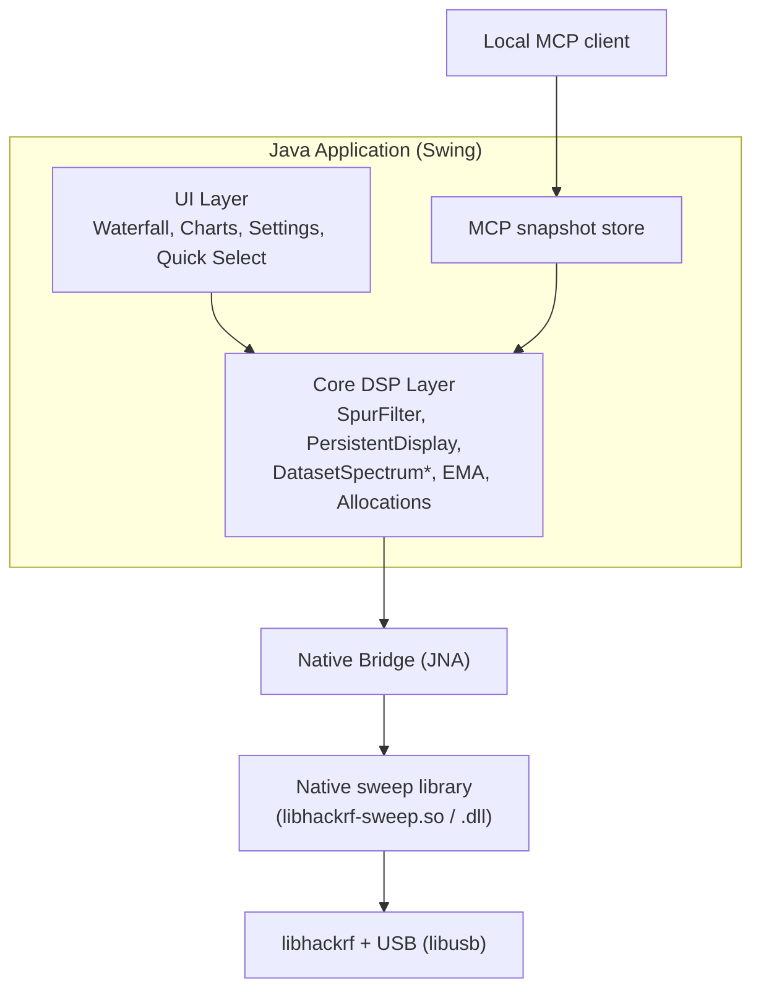
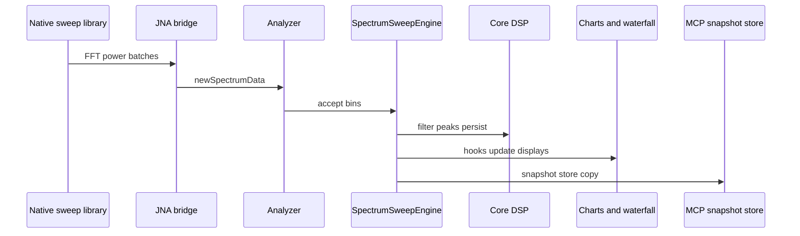
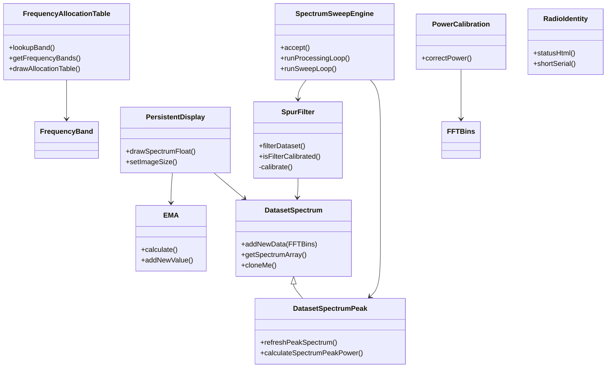
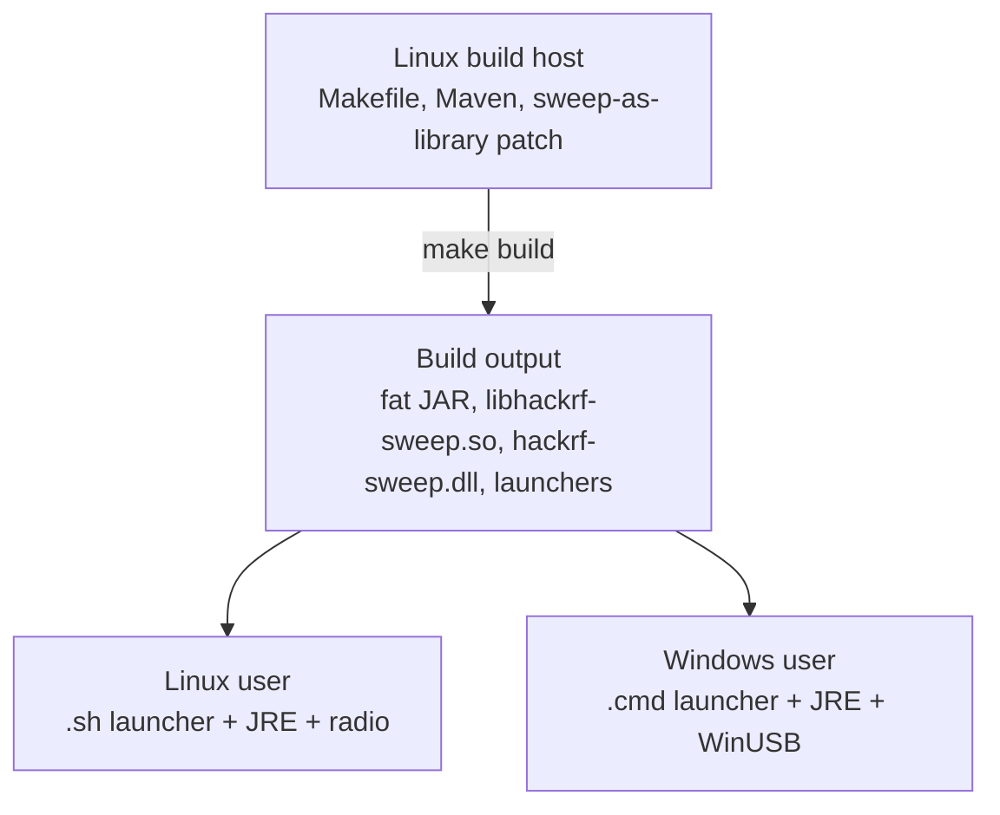
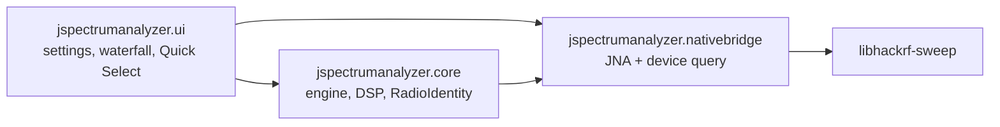

# Architecture

## High-Level Overview

## Key Components

### Core DSP (`jspectrumanalyzer/core/`)
- `DatasetSpectrum`, `DatasetSpectrumPeak`
- `SpectrumSweepEngine`, `SpurFilter`, `PersistentDisplay`
- `AnalyzerSettings` (all `HackRFSettings` model values; radio vs display)
- `FrequencyAxis`, `BandMark`, `WifiBandLayer`, `FmBandLayer` (plot overlays do not invent their own MHz↔pixel map)
- `EMA`, `FFTBins`, `PowerCalibration`, `RadioIdentity`
- Frequency allocation tables

These are the best candidates for unit testing (and have the majority of our test coverage).

### Native Integration
- `src-c/0001-hackrf_sweep-to-library-conversion-v2026.01.3.patch` — Turns the upstream `hackrf_sweep` tool into a reusable library.
- `HackRFSweepNativeBridge.java` + hand-maintained `HackrfSweepLibrary.java` (`make jnabridge` does not regenerate it)
- The build process resets the hackrf submodule to `HACKRF_SDK_PIN` (v2026.01.3) and applies the patch.

### UI Layer
- Swing + FlatLaf + JFreeChart.
- `WaterfallPlot`, `HackRFSweepSettingsUI`, Quick Select (`QuickSelectPreset`), `SweepStatusBar`, radio identity (board / serial / firmware). Spectrum overlays share `FrequencyAxis` + `BandHeaderPainter`: Wi-Fi (`WifiBandLayer`), live US FM (`FmBandLayer` + `FmStationTracker`), and zoomed-out Quick Select (`QuickSelectBandLayer`). Frequency zoom (`SpectrumZoom` + `SpectrumZoomHistory`) retunes the sweep like a Grafana time-range drag.

### Build System
- Root `Makefile` — convenience targets (`make help`, `make test`, `make start`, etc.).
- `src/hackrf-sweep/Makefile` — the real engine (cross-compiles natives + invokes Maven).
- Maven (`pom.xml`) — Java compilation, dependency management, fat JAR assembly.

## Design Goals

- Keep the performance-critical sweep loop in optimized native code.
- Make the Java side as "pure" as possible for the signal processing so it can be unit tested.
- Support both Linux native development and Windows end-users from a single build.

## Data Flow (Simplified)

## Testing Strategy

- Unit tests live under `src/test/java` and focus on `core/`.
- No hardware is required for the unit test suite.
- Graphics and time-dependent behavior use reflection to control internal state where necessary.

See [development.md](development.md) and [testing section in root README](https://github.com/chris-piekarski/hackrf-spectrum-analyzer) for more.

## Core DSP Class Diagram (Simplified)

## Deployment Diagram

## Java Package Structure (Core Focus)

