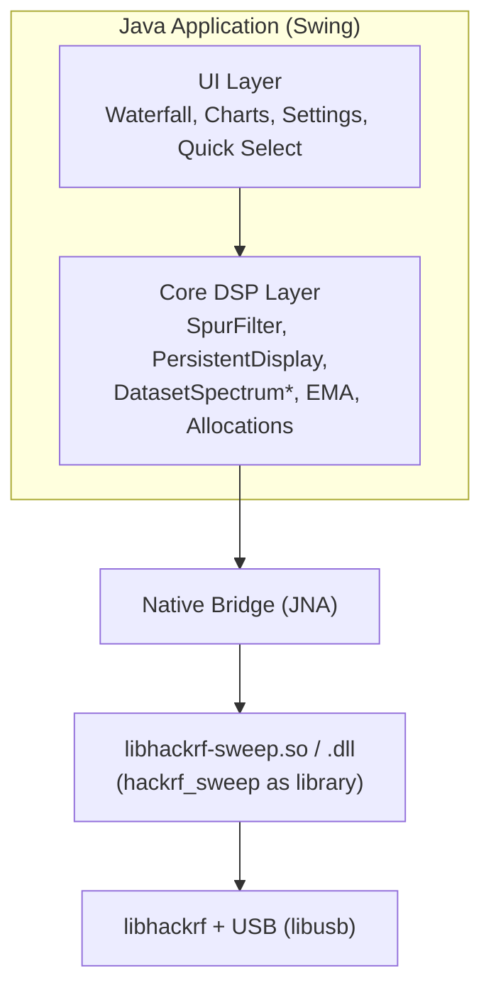
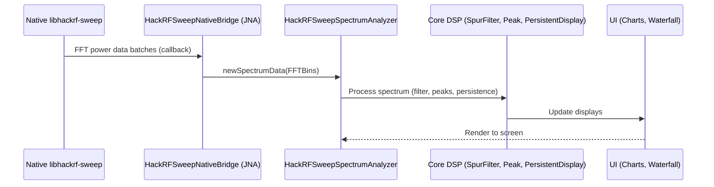
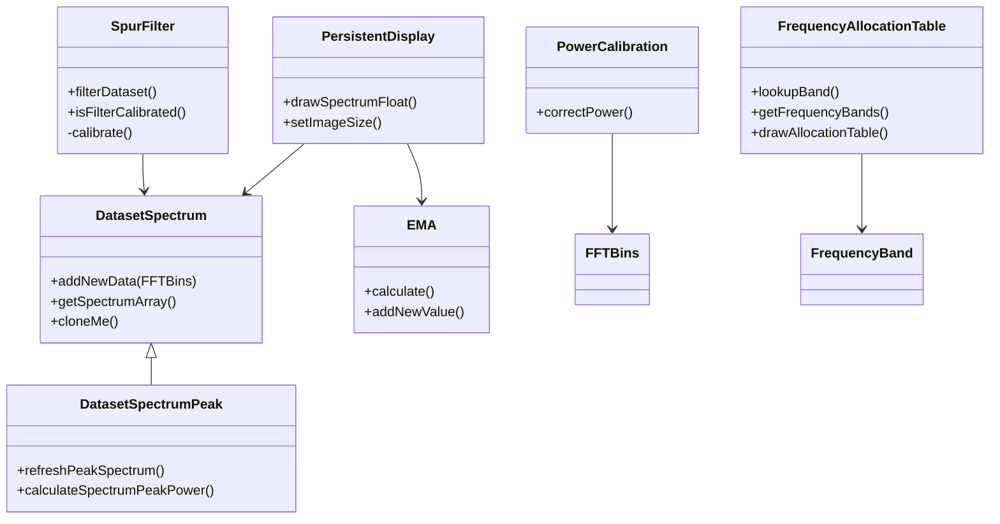
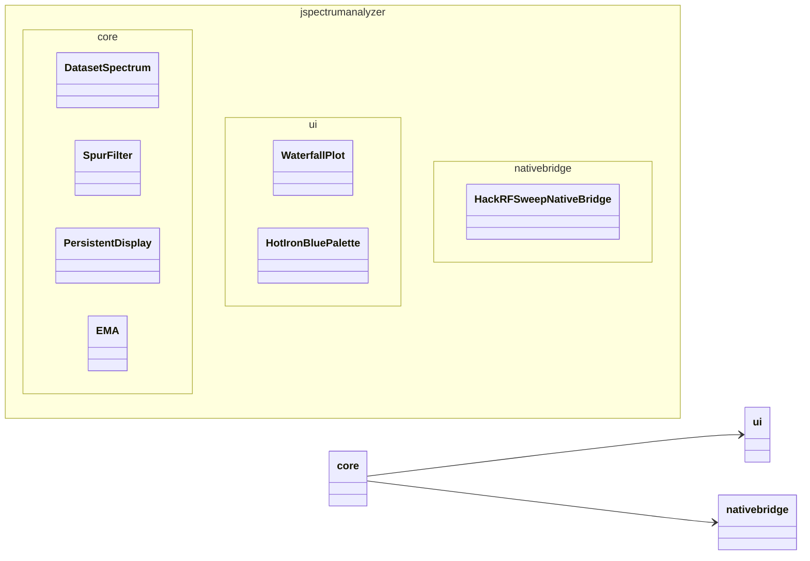

# Architecture

## High-Level Overview



## Key Components

### Core DSP (`jspectrumanalyzer/core/`)
- `DatasetSpectrum`, `DatasetSpectrumPeak`
- `SpurFilter`
- `PersistentDisplay`
- `EMA`, `FFTBins`, `PowerCalibration`
- Frequency allocation tables

These are the best candidates for unit testing (and have the majority of our test coverage).

### Native Integration
- `src-c/0001-hackrf_sweep-to-library-conversion-v2026.01.3.patch` — Turns the upstream `hackrf_sweep` tool into a reusable library.
- `HackRFSweepNativeBridge.java` + generated `HackrfSweepLibrary.java`
- The build process resets the hackrf submodule to `HACKRF_SDK_PIN` (v2026.01.3) and applies the patch.

### UI Layer
- Traditional Swing + JFreeChart.
- `WaterfallPlot`, various settings panels, quick frequency selectors (this fork's addition).

### Build System
- Root `Makefile` — convenience targets (`make help`, `make test`, `make start`, etc.).
- `src/hackrf-sweep/Makefile` — the real engine (cross-compiles natives + invokes Maven).
- Maven (`pom.xml`) — Java compilation, dependency management, fat JAR assembly.

## Design Goals

- Keep the performance-critical sweep loop in optimized native code.
- Make the Java side as "pure" as possible for the signal processing so it can be unit tested.
- Support both Linux native development and Windows end-users from a single build.

## Data Flow (Simplified)



## Testing Strategy

- Unit tests live under `src/test/java` and focus on `core/`.
- No hardware is required for the unit test suite.
- Graphics and time-dependent behavior use reflection to control internal state where necessary.

See [development.md](development.md) and [testing section in root README](https://github.com/chris-piekarski/hackrf-spectrum-analyzer) for more.

## Core DSP Class Diagram (Simplified)



## Deployment Diagram

```mermaid
deploymentDiagram
    node "Developer Machine (Linux)" {
        artifact "Makefile + mvn"
        artifact "src/main/java (core + ui)"
        artifact "src-c (patch)"
    }

    node "Build Output" {
        artifact "hackrf_spectrum_analyzer.jar (fat)"
        artifact "libhackrf-sweep.so"
        artifact "hackrf-sweep.dll (cross)"
        artifact "launchers"
    }

    node "Target: Linux User" {
        artifact "hackrf_sweep_spectrum_analyzer_linux.sh"
        artifact "JRE"
        artifact "HackRF USB"
    }

    node "Target: Windows User" {
        artifact "hackrf_sweep_spectrum_analyzer_windows.cmd"
        artifact "JRE"
        artifact "HackRF USB + WinUSB"
    }

    "Developer Machine (Linux)" --> "Build Output" : make build
    "Build Output" --> "Target: Linux User"
    "Build Output" --> "Target: Windows User"
```

## Java Package Structure (Core Focus)


