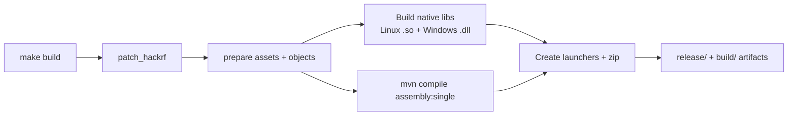

# Building

This project uses a custom Makefile (with Maven under the hood) for a unified Linux + Windows cross-build experience.

**Strongly recommended**: Use `make help` at any time — it is the source of truth for available targets and is kept up to date.

## Quick Build (from repo root)

```bash
make help          # Explore all targets
make deps          # Install all required packages (Ubuntu/Debian)
make build         # Full build (natives + JAR + release zip)
make start         # Build (if needed) + run the Linux app
```

This is the easiest path on Ubuntu/Debian.

## Build Pipeline



## Detailed Requirements (Ubuntu recommended)

```bash
sudo apt install \
  build-essential \
  maven \
  git \
  libusb-1.0-0-dev \
  libfftw3-dev \
  libfftw3-bin \
  default-jdk \
  mingw-w64
```

You will also need the HackRF sources (handled automatically by the build via submodule + patch).

## Common Targets

### From Repository Root

| Target     | Description                          |
|------------|--------------------------------------|
| `build`    | Full build (delegates to subdir)    |
| `clean`    | Remove all build artifacts          |
| `test`     | Run unit tests                      |
| `lint`     | Maven compile check                 |
| `start`    | Launch the Linux app                |
| `run`      | Alias for `start`                   |

### Inside `src/hackrf-sweep/`

Run `make help` inside this directory for advanced / low-level targets:

- `all` (default)
- `jnabridge` — regenerate JNA bindings (needs JDK 8)
- `patch_hackrf` — re-apply the library-mode patch
- `clean`, `prepare`, etc.

## Output Locations

After a successful build you will find:

- `src/hackrf-sweep/build/hackrf-spectrum-analyzer/` — runnable tree with launcher + `lib/`
- `release/` — zipped release artifact (if `zip_file` target ran)

## Cross-Compilation Notes

- Linux build produces both the Linux `.so` **and** the Windows `.dll` (using mingw-w64).
- The hackrf submodule is automatically reset to v2024.02.1 and patched during build.
- The Java fat JAR is built with Maven (assembly plugin).

## Troubleshooting Builds

- Missing `mingw-w64` → Windows DLLs won't build.
- Wrong JDK version for `jnabridge` → JNAerator is picky (needs Java 8).
- Submodule not initialized → run `git submodule update --init --recursive`.
- Permission issues on Linux → see [hackrf-setup.md](hackrf-setup.md) for udev rules (also needed at runtime).

For the most current instructions, always run `make help` rather than relying solely on this document.