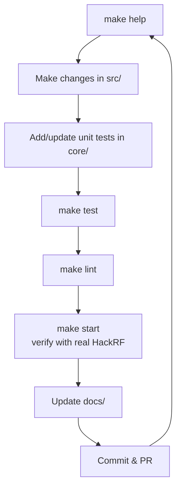

# Development Guide

## Getting the Code

```bash
git clone --recurse-submodules https://github.com/chris-piekarski/hackrf-spectrum-analyzer.git
cd hackrf-spectrum-analyzer
make help
```

## Daily Development Workflow



## Testing

We have **25 unit test classes** focused on the pure Java core logic.

```bash
make test
# or
cd src/hackrf-sweep && mvn clean test
```

`make test` must stay green. Tests compile as Java 8 (no `var`). Surefire runs headless; `GraphicsToolkit` falls back to `BufferedImage` so image/DSP tests still execute.

Coverage report (JaCoCo is attached via `@{argLine}` in `pom.xml`):

```bash
make test
# open src/hackrf-sweep/target/site/jacoco/index.html
```

**Guideline**: New logic in `jspectrumanalyzer/core/` should come with unit tests. Use synthetic `DatasetSpectrum` / `FFTBins` data. Reflection is acceptable for controlling time-based or internal graphics state in `PersistentDisplay` and `DatasetSpectrumPeak`.

### Test → Coverage Workflow

```mermaid
sequenceDiagram
    participant Dev as Developer
    participant Make as make test
    participant Maven as mvn test
    participant JaCoCo as JaCoCo Agent
    participant Report as target/site/jacoco

    Dev->>Make: make test
    Make->>Maven: mvn clean test
    Maven->>JaCoCo: Instrument classes
    Maven->>Maven: Run JUnit tests (25 classes)
    JaCoCo->>Report: Generate coverage data
    Maven-->>Make: Report summary
    Dev->>Report: Open index.html
    Note over Dev,Report: Aim for >80% on core/; project ~50% before large refactors
```


## Linting & Quality

```bash
make lint          # Runs Maven compile
```

There is currently no strict Java formatter or Checkstyle enforced, but please keep code style consistent with surrounding files.

For the native C parts, a clang-format command is commented in the Makefile.

## Documentation

- All user/developer documentation lives under `docs/`.
- Keep `docs/` in sync with `make help` output.
- The root `README.md` and `AGENTS.md` should be updated when processes change significantly.
- Do **not** edit the legacy `Readme.md` files — they are being phased toward the `docs/` structure.

## Architecture Notes

See [architecture.md](architecture.md) for a high-level overview.

Key directories:
- `src/hackrf-sweep/src/main/java/jspectrumanalyzer/core/` — Pure DSP logic (best place for unit tests)
- `src/hackrf-sweep/src/main/java/jspectrumanalyzer/ui/` — Swing UI
- `src/hackrf-sweep/src/main/java/jspectrumanalyzer/nativebridge/` — JNA glue
- `src/hackrf-sweep/src-c/` — Patch that turns hackrf_sweep into a library
- `src/hackrf-sweep/lib/hackrf/` — Submodule (automatically patched during build)

## Working with AI Agents

See the root `AGENTS.md` file. It contains specific instructions for coding agents (always start with `make help`, prefer `docs/`, add tests for core changes, etc.).

Living work plans (coverage, larger refactors) live under [plans/](plans/README.md). The current coverage plan is [plans/unit-test-coverage.md](plans/unit-test-coverage.md).

## Syncing with Upstream

This repo is a GitHub fork of [pavsa/hackrf-spectrum-analyzer](https://github.com/pavsa/hackrf-spectrum-analyzer), but the two histories do **not** share commit SHAs (the old commits were rewritten). GitHub's "N commits ahead / M commits behind" banner therefore counts *every* commit on both sides and is not a reliable merge signal.

Do **not** rebase this fork onto `upstream/master` or merge with a default recursive strategy — that would fight the Maven layout, tests, docs, and Quick Select work.

The 2024 upstream release (`v2024.11.10`) is already absorbed: Antenna LNA, hackrf `v2024.02.1` submodule + patch, Maven dependencies (JFreeChart 1.5 / JNA 5.15 / MigLayout 11), min FFT bin size, and the JFreeChart 1.5 renderer API.

To inspect future upstream changes:

```bash
git remote add upstream https://github.com/pavsa/hackrf-spectrum-analyzer.git   # once
git fetch upstream
git log --oneline master..upstream/master
git diff master upstream/master -- src/hackrf-sweep/src/main/java
```

Port individual bugfixes by reading the upstream commit and applying the same change onto this tree. Keep fork-only files (Quick Select, `docs/`, tests, root `Makefile`).

If you have already reviewed and ported everything you want from the current upstream tip, you can record that without taking their tree:

```bash
git merge --allow-unrelated-histories -s ours upstream/master
```

That marks upstream as an ancestor so GitHub shows 0 behind, while leaving this fork's files untouched. Only do this after a file-level review.

## Releasing

1. Bump version in `Version.java` (and any other places).
2. Run full `make build`.
3. Test the resulting zip/launcher on target platforms.
4. Tag and push.

## Getting Help

- Run `make help`
- Read the docs under `docs/`
- Check existing issues / discussions on GitHub

Happy hacking!