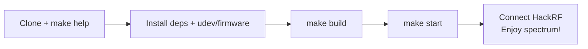

# Getting Started



This guide will get you up and running with the HackRF Spectrum Analyzer GUI.

## Prerequisites

### Hardware
- HackRF One (or compatible)
- Recommended firmware: **v2024.02.1** or newer

### Software
- Java (OpenJDK 8 or later recommended)
- For building from source (recommended for Linux):
  - Maven
  - GCC toolchain + mingw-w64 (for cross-compiling Windows natives)
  - libusb-1.0, libfftw3, etc. (see [building.md](building.md))

## Quick Start (Pre-built)

1. Download the latest release from the upstream project (or build this fork).
2. **Windows**:
   - Install HackRF drivers with Zadig (if on Windows 10 or earlier).
   - Run the provided `.cmd` launcher.
3. **Linux**:
   - Ensure udev rules are set up for the HackRF (see [hackrf-setup.md](hackrf-setup.md)).
   - Run the provided launcher script after extracting.

## Building from Source

See the detailed [building.md](building.md) guide.

From the repository root:

```bash
make help          # See all available targets
make info          # Confirm the HackRF, show app SDK/API pin, check for firmware/SDK updates
make build
make start         # Builds (if needed) and launches the Linux app
```

## First Run Tips

- The app should detect your HackRF automatically when plugged in with correct permissions.
- Use the **Quick Select** buttons (added in this fork) for common bands (WiFi, LTE, FM, etc.).
- The **Antenna LNA +14dB** checkbox enables the external amplifier on supported hardware.
- Change any setting — the sweep automatically restarts.

## Next Steps

- [Usage & Features](usage.md)
- [HackRF Hardware Setup](hackrf-setup.md)
- [Development](development.md) if you want to contribute or customize