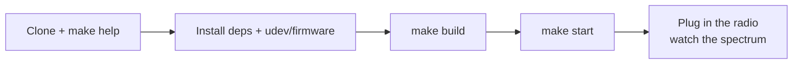

# Getting Started



Turn a HackRF into a live spectrum and waterfall display.

## What you need

### Hardware
- HackRF One (or compatible)
- Firmware **v2024.02.1** or newer (this app matches host SDK **v2026.01.3**)

### Software
- Java 21+ with a desktop (OpenJDK / Temurin — not a headless JRE)
- To build on Linux: Maven, GCC, mingw-w64 (for the Windows natives), libusb and FFTW — see [building.md](building.md)

## Fastest path

From the repository root:

```bash
make help          # every target, with descriptions
make info          # confirm the radio, firmware, and SDK pin
make udev          # Linux once: persistent USB permissions
make start         # build if needed, then launch
```

The sidebar shows the board name, short serial, and firmware when the radio opens. Hover that line for the full serial and USB API.

## If you already have a zip / installer

1. **Windows**: install the WinUSB driver with Zadig if Windows has not claimed the device. Run the `.cmd` launcher in the package.
2. **Linux**: set udev rules ([hackrf-setup.md](hackrf-setup.md)), then run the launcher script.

## First run

- Plug the radio in before you click around. The sweep starts on its own.
- **Quick Select** jumps to common bands (Wi‑Fi, LTE, FM, amateur 2 m / 70 cm, …). Hover a button for the MHz range. Details: [usage.md](usage.md).
- **Antenna LNA +14 dB** turns on the amplifier on the radio. Use it when the signal is weak; skip it on strong local transmitters.
- Changing start/end frequency, gain, or FFT bin retunes automatically.

## Next

- [Usage](usage.md) — buttons, gain, and the status line
- [Radio setup](hackrf-setup.md) — firmware, udev, Zadig
- [Development](development.md) — if you are changing the code
