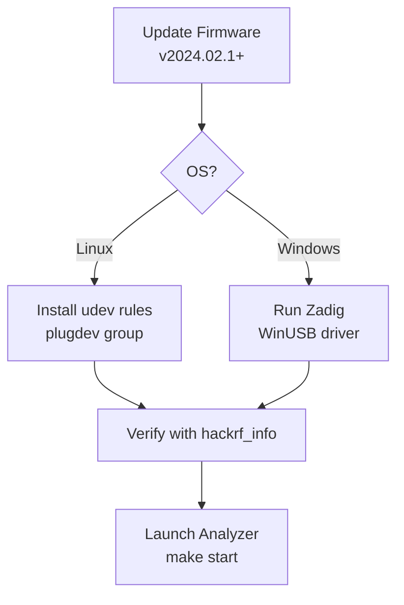

# HackRF Hardware Setup



Proper USB permissions and firmware are critical for reliable operation.

## Firmware

**Minimum recommended**: v2024.02.1

Update instructions: https://hackrf.readthedocs.io/en/latest/updating_firmware.html

It is often easiest to perform the update from a Linux virtual machine.

## Linux USB Permissions (udev)

The hackrf library will not be able to open the device by default on most distributions.

Create a udev rule:

```bash
sudo tee /etc/udev/rules.d/53-hackrf.rules << 'EOF'
# HackRF One
ATTR{idVendor}=="1d50", ATTR{idProduct}=="6089", MODE="0666", GROUP="plugdev"
# Other HackRF products if needed
ATTR{idVendor}=="1d50", ATTR{idProduct}=="604b", MODE="0666", GROUP="plugdev"
ATTR{idVendor}=="1d50", ATTR{idProduct}=="6089", MODE="0666", GROUP="plugdev"
EOF

sudo udevadm control --reload-rules
sudo udevadm trigger
```

Add your user to the `plugdev` group (or the group used in the rule):

```bash
sudo usermod -a -G plugdev $USER
```

Log out and back in (or reboot).

Verify with:

```bash
hackrf_info
```

You should see your device without permission errors.

## Windows

- Windows 11 usually works with the default driver.
- On Windows 10 and earlier, use **Zadig**:
  1. Download Zadig (https://zadig.akeo.ie/)
  2. Options → List All Devices
  3. Select "HackRF One"
  4. Choose "WinUSB" driver and install

## Troubleshooting

- "No HackRF boards found" → Check udev / Zadig / cable / firmware.
- Device disappears after parameter change → Power cycle the HackRF (known firmware quirk).
- Permission denied on Linux → Re-check udev rules and group membership.

See also the "Known issues" section in the main README.