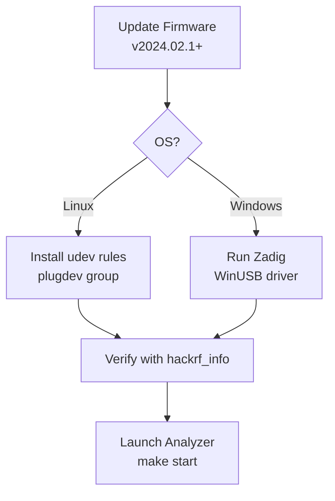

# HackRF Hardware Setup



Proper USB permissions and firmware are critical for reliable operation.

## Firmware

**Minimum recommended**: v2024.02.1

From this repo (HackRF One attached, usbfs writable):

```bash
make firmware-update                         # dry-run: detect board, download image, print sha256
make firmware-update VERSION=2026.01.3 CONFIRM=1   # write SPI flash
```

`CONFIRM=1` is required to write. The target refuses HackRF Pro images on a One, refuses if the usbfs node is not writable, and is **not** run by `make build` or `make test`.

After a write, press RESET (WSL: `usbipd detach` / `attach`) and run `make info`.

Official instructions: https://hackrf.readthedocs.io/en/latest/updating_firmware.html

It is often easiest to perform the update from a Linux virtual machine.

## Linux USB Permissions (udev)

The hackrf library will not be able to open the device by default on most distributions.

Create a udev rule:

```bash
sudo tee /etc/udev/rules.d/53-hackrf.rules << 'EOF'
# HackRF One
ATTR{idVendor}=="1d50", ATTR{idProduct}=="6089", MODE="0666", GROUP="plugdev"
# Other HackRF products if needed
ATTR{idVendor}=="1d50", ATTR{idProduct}=="604b", MODE="0666", GROUP="plugdev"
ATTR{idVendor}=="1d50", ATTR{idProduct}=="6089", MODE="0666", GROUP="plugdev"
EOF

sudo udevadm control --reload-rules
sudo udevadm trigger
```

Add your user to the `plugdev` group (or the group used in the rule):

```bash
sudo usermod -a -G plugdev $USER
```

Log out and back in (or reboot).

Verify with:

```bash
make info          # USB, device firmware, app SDK/USB API pin, and whether a newer GSG release exists
hackrf_info        # official tool (optional; same firmware fields)
```

You should see your device without permission errors. `make info` still lists the USB node if firmware cannot be read (typical WSL `root:root` usbfs).

## WSL2 (Windows host, Linux build)

Windows does not share USB with WSL2 until you attach the device:

```powershell
usbipd list
usbipd bind --busid <BUSID>          # once, as Administrator
usbipd attach --wsl --busid <BUSID>  # after each unplug/reboot
```

HackRF One is `1d50:6089`. In WSL, `lsusb` should then show Great Scott Gadgets HackRF One.

usbipd device nodes are often `root:root` and not writable. Either add the udev rule below or:

```bash
sudo chmod a+rw /dev/bus/usb/00X/00Y
```

List the radio and run hardware smoke tests (not part of `make test`):

```bash
make info          # USB + firmware + SDK/API versions vs latest GSG release
make test-hw
```

They skip if no HackRF is enumerated. The sweep IT also needs `libhackrf-sweep.so` from `make build` and a writable usbfs node.

## Windows

- Windows 11 usually works with the default driver.
- On Windows 10 and earlier, use **Zadig**:
  1. Download Zadig (https://zadig.akeo.ie/)
  2. Options → List All Devices
  3. Select "HackRF One"
  4. Choose "WinUSB" driver and install

## Troubleshooting

- "No HackRF boards found" → Check udev / Zadig / cable / firmware.
- Device disappears after parameter change → Power cycle the HackRF (known firmware quirk).
- Permission denied on Linux → Re-check udev rules and group membership.

See also the "Known issues" section in the main README.