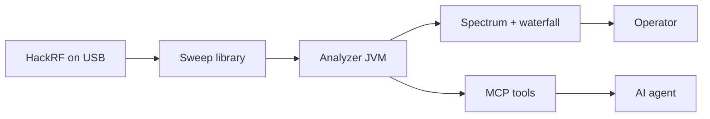

# MCP — AI agents on the live sweep

This is a **HackRF spectrum analyzer with a Model Context Protocol (MCP) interface**. You watch the plot. A local agent (Grok, Claude, Cursor, or anything that speaks MCP) queries the **same bins**, on the **same JVM**, without opening a second radio.



Start it with `make mcp`. Point the agent at `scripts/mcp-spectrum-proxy.py`. Ask what is on the air.

## What an agent can answer

| Question | Tool |
|---|---|
| Where is the peak, and how loud is the noise? | `spectrum_summary` |
| Give me the filled bins (optional `maxPoints`, `minDbm`) | `spectrum_snapshot` |
| What radio is attached (board, serial, firmware, USB API)? | `radio_identity` |
| What is the radio vs display config (range, FFT, LNA/VGA, auto-gain)? | `sweep_config` |
| Which US FM dial hits are live right now? | `fm_stations` |

Hop holes are **omitted**, not reported as −150 dBm. Snapshots are sampled at most **10 Hz**. v1 is **read-only**: the agent cannot retune or change gain.

## Start

The GUI owns USB. MCP is opt-in on that process:

```bash
make mcp                 # GUI + listen on 127.0.0.1:8765
# or
./src/hackrf-sweep/build/hackrf-spectrum-analyzer/hackrf_sweep_spectrum_analyzer_linux.sh --mcp
# optional: --mcp-port=8765   --mcp-stdio
```

Client config (stdio proxy; the analyzer must already be listening):

```json
{
  "mcpServers": {
    "spectrum-analyzer": {
      "command": "python3",
      "args": ["scripts/mcp-spectrum-proxy.py"],
      "env": { "SPECTRUM_MCP_PORT": "8765" }
    }
  }
}
```

Run the proxy from the repo root (or pass an absolute path to the script).

## Why this shape

- **One radio.** A second `hackrf_sweep` would fight the GUI for USB.
- **Same data as the plot.** The store is filled from `onFullSweepProcessed`, not from screenshots or log scraping.
- **Safe for agents.** JSON-RPC on localhost / stdio. No LAN listen in v1. No USB restart from a snapshot tool.
- **Operator-first defaults.** Auto gain, auto-scale dB, and a waterfall time axis so humans and agents see a usable band.

Implementation: `jspectrumanalyzer.mcp` (`SpectrumSnapshotStore`, `SpectrumMcpServer`, `SpectrumMcpTools`). Design notes: [architecture.md](architecture.md). Operator UI: [usage.md](usage.md).
