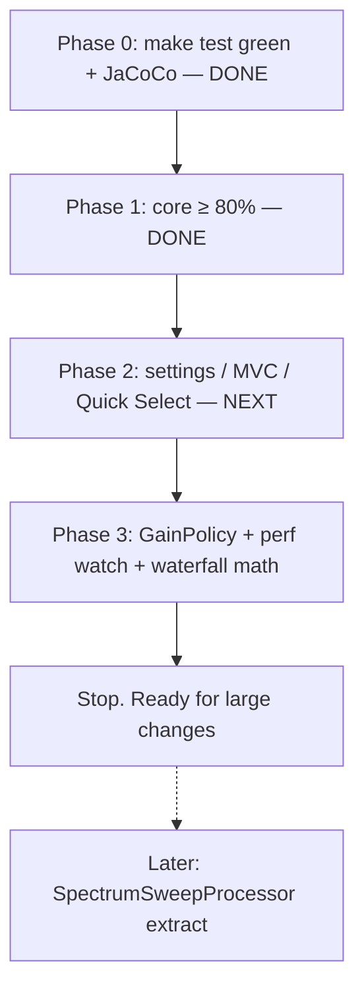

# Plan: Make the test harness trustworthy, then raise project coverage

| Field | Value |
|---|---|
| **Status** | In progress |
| **Started** | 2026-08-17 |
| **Last updated** | 2026-08-17 |
| **Owner / PR split** | See [Suggested PR split](#suggested-pr-split) |

## Goal

Before any large-scale feature or refactor work, the suite must actually run (`make test` green) and give a real coverage signal. Then raise **project-level line coverage to about 50%**, and keep **`jspectrumanalyzer.core` at ≥80%** (the existing docs target).

That is enough of a safety net to change DSP, settings, and UI without flying blind. It is **not** 80% of the whole app — the remaining missed lines are mostly the Swing+JNA God class and native glue, which we should not fake-cover.

## Current measured state

Recorded after Phase 0 (`make test` + JaCoCo report on 2026-08-17).

| Metric | Baseline (before Phase 0) | Now |
|---|---|---|
| Test classes / `@Test` methods | 25 / 92 | 25 / 92 |
| `make lint` | Pass | Pass |
| `make test` | Failed at **test-compile** | **92 tests, 0 failures** |
| Project line coverage | 26.8% (582 / 2,173) | **45.5%** (997 / 2,192) |
| `core` | 45.1% | **86.9%** (458 / 527) |
| `shared.mvc` | 4.2% | **86.3%** (82 / 95) |
| Main analyzer package | ~0% (~664 lines) | still ~0% (by design) |
| JaCoCo via `make test` | Broken (Surefire dropped the agent) | Report written to `src/hackrf-sweep/target/site/jacoco/index.html` |

Phase 1’s **core ≥80%** target is already met because existing tests now run. Remaining Phase 1 items are optional polish, not a blocker.

## Rules (keep the harness useful)

- Stay on **Java 8** (`var` is forbidden in tests). No Mockito. Match existing style: JUnit 5, synthetic `DatasetSpectrum` / `FFTBins`, same-package field access, reflection only for private time/graphics state.
- **Do not construct `HackRFSweepSpectrumAnalyzer`**. Class-load pulls JNA (`hackrf-sweep`); the ctor builds a maximized `JFrame` and starts the native sweep.
- **Do not invent production APIs** just to match broken tests (`getName()`, `ModelValue.Listener`, `removeListener`, `getBandCount()`, generic `MVCController<>`).
- Small production fixes that unlock tests **are in scope**: headless image fallback, `java.awt.Label` → `JLabel`, null-safe `getFrequencyBands`.
- Extract tiny pure helpers from the God class only when the alternative is an untestable 80-line private method.

## Target numbers

| After | `make test` | Project lines | `core` lines | Status |
|---|---|---|---|---|
| Phase 0 | Green, JaCoCo report written | ~30% (existing tests finally run) | ~60% | **Done** — exceeded (45.5% / 86.9%) |
| Phase 1 | Green | ~38–42% | **≥80%** | **Done** for the core target; leftover items optional |
| Phase 2 | Green | **~50%** | ≥80% | **Not started** |
| Phase 3 | Green | ~50%+ from GainPolicy / waterfall math | ≥80% | **Not started** |
| Stop | — | Do not chase 80% project by constructing the God class | | |

---

## Checklist

### Phase 0 — Make `make test` a real gate

**Intent:** the next change cannot ship if the suite is red.

- [x] **0a.** Surefire `argLine` is `@{argLine} -Djava.awt.headless=true` so JaCoCo instruments
- [x] **0b.** Four test files compile on Java 8 / current APIs
  - [x] `FrequencyAllocationsTest` — no `var`, no `getBandCount()`
  - [x] `DatasetSpectrumTest` — explicit type; `addNewData` freqs in **Hz**
  - [x] `MVCControllerTest` — no diamond; EDT flush
  - [x] `ModelValueTest` — `toString()`, `Consumer`/`Runnable`, no `removeListener`
- [x] **0c.** Peak-fall assertion uses a large enough `dt` (algorithm unchanged)
- [x] **0d.** Production unlocks
  - [x] `GraphicsToolkit` headless `BufferedImage` fallback
  - [x] `FrequencyAllocationTable.getFrequencyBands` null-safe when `lookupBand` is null
  - [x] Settings version `java.awt.Label` → `JLabel`
- [x] **0e.** `make test` green; JaCoCo HTML exists; baseline recorded here

### Phase 1 — Finish core DSP

**Intent:** pin ingest / peaks / persistence / allocations. Core is already **86.9%**; do these only if a later change needs a tighter pin.

- [x] `FrequencyAllocations` Europe + USA load + `lookupBand` (covered by fixed `FrequencyAllocationsTest`)
- [x] `FrequencyAllocationTable` draw + range queries (existing tests now run)
- [x] `PersistentDisplay` image/draw tests run under headless
- [x] `DatasetSpectrum` Hz ingest + XY export (fixed existing tests)
- [ ] `DatasetSpectrumPeak` leftovers: `createPeaksDataset`, `fillPeaksToXYSeries`, `setPeakFalloutMillis` (optional)
- [x] `ModelValue*` real API (rewritten tests)

Leave `SpurFilter`, `EMA`, `PowerCalibration`, palettes, jfc adapters alone — already high.

### Phase 2 — Settings / MVC / selectors (next)

**Intent:** project coverage toward **50%**; lock Quick Select + settings.

- [ ] `MVCController` remaining binders (`JComboBox`) + `disableViewListeners` loop guard
- [ ] `FakeHackRFSettings` test double under `src/test/java/jspectrumanalyzer/`
- [ ] `HackRFSweepSettingsUI(HackRFSettings)` bind: FFT bin string, pause label, peak-fall / decay visibility, hardware-status text. Skip `Desktop.browse`
- [ ] `FrequencySelectorRangeBinder` + Quick Select: `doClick()` each band; assert MHz pairs; veto start≥end
- [ ] `FrequencySelectorPanel` leftover: `+`/`-` digit buttons; clamp min/max

Optional extract if the band table is about to change: `QuickBandPresets.rangeFor(String)`.

### Phase 3 — Testable slices of the God class

- [ ] Extract `GainPolicy` from `recalculateGains` (table-driven LNA/VGA steps)
- [ ] Move `RuntimePerformanceWatch` / `PerformanceEntry` to their own type + tests
- [ ] Waterfall **math only** (`powerToNormalized` / column-max). Do not pixel-test `paintComponent`

**Out of scope until a dedicated refactor:**

- `processingThread` → `SpectrumSweepProcessor`
- `HackRFSweepNativeBridge` / `HackrfSweepLibrary`
- Analyzer ctor / `sweep` / `stopHackrfSweep` / `setupChart`
- `ScreenCapture.captureFrame` (`System.exit(0)` on finish)

---

## Suggested PR split

1. **Harness (Phase 0)** — pom `argLine`, compile fixes, peak-fall assert, Hz ingest, EDT flush, `GraphicsToolkit` headless, `getFrequencyBands` NPE, `Label` → `JLabel`. *(Implemented locally 2026-08-17; commit when ready.)*
2. **Core leftovers (optional Phase 1)** — Peak dataset/fill APIs only if needed.
3. **UI/settings (Phase 2)** — FakeHackRFSettings, SettingsUI bind, Quick Select table, digit buttons.
4. **Small extracts (Phase 3)** — GainPolicy + RuntimePerformanceWatch (+ optional waterfall math).

Each PR: `make lint` + `make test` + paste the JaCoCo line % for project and `core` in the PR body. **Update this file’s Status / Current measured state / checkboxes in the same change.**

## What this does *not* buy

End-to-end “HackRF plugged in, sweep runs” still requires `make start` on real hardware. Native C / JNA is still untested. The plan makes the **Java logic** safe to change; it does not replace a device smoke test.
