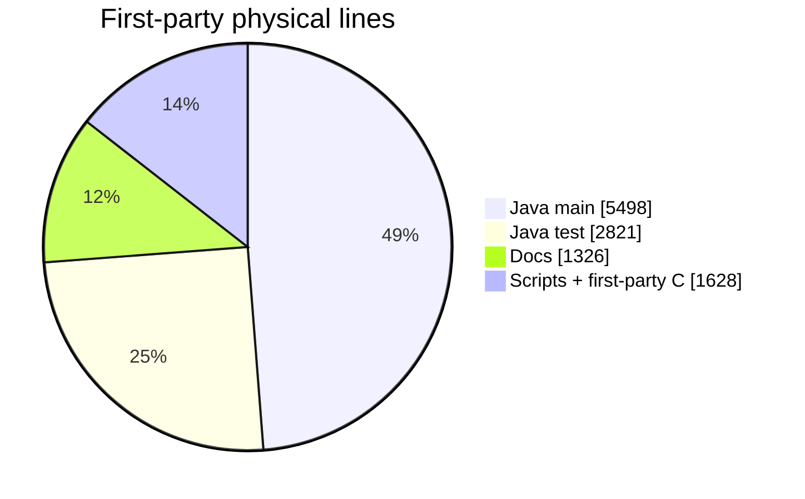
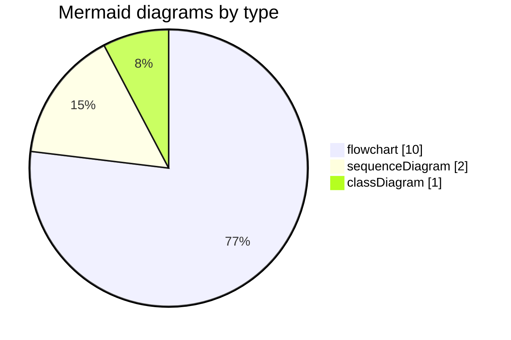

<!-- Generated by scripts/repo-stats.py / `make stats`. Do not edit by hand. -->

# Repository stats

Refreshed **2026-08-19 03:06 UTC** from `9ca0b23` on `master` (last commit 2026-08-18 09:06:40 -0600).

Regenerate:

```bash
make stats
# or
python3 scripts/repo-stats.py
```

Vendor trees (`src/hackrf-sweep/lib/hackrf`, libusb, FFTW), `target/`, and `build/` are **excluded**. These numbers describe first-party code and docs.

## Snapshot

| | |
|---|---|
| App version | `v2024.11.10-fork` |
| Java `--release` | 21 |
| Host SDK pin | `v2026.01.3` |
| Minimum firmware | `2024.02.1` |
| Quick Select presets | 15 |
| USA allocation rows | 574 |
| Git commits on this branch | 96 |
| First-party lines (all counted trees) | 11273 |



## Java by area

Production (`src/main/java`): **40** files, **5498** lines.

| Package | Files | Lines |
|---|---:|---:|
| `jspectrumanalyzer/core` | 16 | 1819 |
| `jspectrumanalyzer/ui` | 12 | 1584 |
| `jspectrumanalyzer` | 2 | 1206 |
| `jspectrumanalyzer/capture` | 2 | 282 |
| `jspectrumanalyzer/nativebridge` | 3 | 281 |
| `shared/mvc` | 2 | 244 |
| `jspectrumanalyzer/core/jfc` | 2 | 61 |
| `hackrfsweep` | 1 | 21 |

Tests (`src/test/java`): **41** files, **2821** lines.

| Package | Files | Lines |
|---|---:|---:|
| `jspectrumanalyzer/core` | 15 | 1068 |
| `jspectrumanalyzer/ui` | 11 | 603 |
| `jspectrumanalyzer/hw` | 5 | 553 |
| `jspectrumanalyzer` | 3 | 218 |
| `shared/mvc` | 2 | 186 |
| `jspectrumanalyzer/nativebridge` | 1 | 83 |
| `jspectrumanalyzer/core/jfc` | 3 | 74 |
| `jspectrumanalyzer/capture` | 1 | 36 |

### Tests

| Kind | Count |
|---|---:|
| Unit test classes (`@Test`, not `*IT`) | 35 |
| `@Test` methods (unit + hardware IT) | 131 |
| Hardware IT classes (`*IT`) | 1 |
| `@HardwareTest` methods | 7 |
| Support types (fakes, annotations, helpers) | 5 |

`make test` runs the unit classes only. `make test-hw` runs the hardware IT and skips if no radio is enumerated.

## Other first-party trees

| Tree | Files | Lines |
|---|---:|---:|
| Docs (`docs/`) | 13 | 1326 |
| Scripts (`scripts/`) | 6 | 1094 |
| First-party C / patch (`src-c/`) | 3 | 534 |

## Build surface

| Makefile | Documented / named targets |
|---|---|
| Root | 16 (`help`, `deps`, `runtime-deps`, `build`, `clean`, `test`, `test-hw`, `lint`, `stats`, `mermaid`, `info`, `list-devices`, `firmware-update`, `udev`, `start`, `run`) |
| `src/hackrf-sweep` | 20 |

## Diagrams

13 Mermaid fences in first-party Markdown. Check they still parse with `make mermaid`.

| File | Type |
|---|---|
| `README.md` | `flowchart` |
| `docs/architecture.md` | `classDiagram` |
| `docs/architecture.md` | `flowchart` |
| `docs/architecture.md` | `flowchart` |
| `docs/architecture.md` | `flowchart` |
| `docs/architecture.md` | `sequenceDiagram` |
| `docs/building.md` | `flowchart` |
| `docs/contributing.md` | `flowchart` |
| `docs/development.md` | `flowchart` |
| `docs/development.md` | `sequenceDiagram` |
| `docs/getting-started.md` | `flowchart` |
| `docs/hackrf-setup.md` | `flowchart` |
| `docs/usage.md` | `flowchart` |



## Largest first-party Java files

| File | Lines |
|---|---:|
| `src/hackrf-sweep/src/main/java/jspectrumanalyzer/HackRFSweepSpectrumAnalyzer.java` | 1199 |
| `src/hackrf-sweep/src/main/java/jspectrumanalyzer/ui/HackRFSweepSettingsUI.java` | 454 |
| `src/hackrf-sweep/src/main/java/jspectrumanalyzer/ui/WaterfallPlot.java` | 361 |
| `src/hackrf-sweep/src/main/java/jspectrumanalyzer/core/PersistentDisplay.java` | 268 |
| `src/hackrf-sweep/src/main/java/jspectrumanalyzer/core/SpurFilter.java` | 244 |
| `src/hackrf-sweep/src/main/java/jspectrumanalyzer/ui/FrequencySelectorPanel.java` | 230 |
| `src/hackrf-sweep/src/main/java/jspectrumanalyzer/core/SpectrumSweepEngine.java` | 220 |
| `src/hackrf-sweep/src/test/java/jspectrumanalyzer/hw/HackRFSweepHardwareIT.java` | 218 |

`HackRFSweepSpectrumAnalyzer.java` is the Swing shell. Prefer growing `core/` and tests rather than this class.

## Git authors

| Author | Commits |
|---|---:|
| Pavol Sakac | 27 |
| selabnayr | 24 |
| Chris Piekarski | 16 |
| _sekki | 12 |
| pavsa | 10 |
| Christopher Piekarski | 3 |
| Kezi | 2 |
| izzy84075 | 2 |

## How this is counted

- Physical lines (newline-separated), UTF-8, replacement on decode errors.
- A Java *unit test class* is a file that contains `@Test` and is not named `*IT.java`.
- Quick Select presets are enum constants in `QuickSelectPreset`.
- USA allocation rows are data lines in `freq-usa.csv` (header excluded).
- Re-run after large moves or new packages so [AGENTS.md](../AGENTS.md) can point here instead of baking stale counts.
