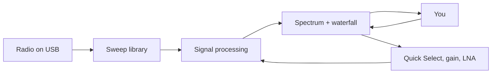

# Usage

## Start

```bash
make start
```

That builds if needed and opens the window. You can also run the packaged launcher after a build:

```bash
./src/hackrf-sweep/build/hackrf-spectrum-analyzer/hackrf_sweep_spectrum_analyzer_linux.sh
```

Windows ships a `.cmd` next to it. The filename is leftover from the native library; the window title is just **Spectrum Analyzer**.

## MCP (agents)

This app is built so a **local AI agent** can read the live sweep. Product pitch, tool table, and client config: **[mcp.md](mcp.md)**.

The running process exposes a **read-only** MCP server so an agent can pull the same sweep the plot is showing. It does **not** open a second radio. Operator flags:

```bash
make mcp                 # GUI + listen on 127.0.0.1:8765
# or
./src/hackrf-sweep/build/hackrf-spectrum-analyzer/hackrf_sweep_spectrum_analyzer_linux.sh --mcp
# optional: --mcp-port=8765   --mcp-stdio
```

Point a local MCP client at the stdio proxy (the GUI must already be listening):

```json
{
  "mcpServers": {
    "spectrum-analyzer": {
      "command": "python3",
      "args": ["scripts/mcp-spectrum-proxy.py"],
      "env": { "SPECTRUM_MCP_PORT": "8765" }
    }
  }
}
```

Tools: `spectrum_summary`, `spectrum_snapshot` (optional `maxPoints`, `minDbm`), `radio_identity`, `sweep_config` (radio vs display, including `autoScale` and `autoGain`), `fm_stations`, `spectrum_occupancy`, `spectrum_history` (summaries, optional `seconds` / `maxSamples`). Unfilled hop holes are omitted, not reported as −150 dBm. Snapshots are sampled at most 10 times per second. Agents cannot change frequency or gain in v1. The GUI must already hold the radio; MCP does not open a second USB device.

## What you are looking at



- **Spectrum** — power vs frequency for the current sweep. **Auto gain** (default) sets LNA then VGA so the live peak sits near −28 dBm for this Quick Select. The **dB axis auto-scales** the live band (10 dB pad, 10 dB ticks). Turn **Auto-scale dB axis** off under Chart options for a fixed **−100…+20** window. When auto-scale is on, the **waterfall palette** uses the same window so FM/Wi-Fi peaks are not crushed into the blue end of a fixed −90…−25 scale. Auto-scale holds through wobble and bursty peaks, opens a tick only if a signal would clip, and shrinks at most one 10 dB tick every few seconds if that whole stretch stayed quiet. **Drag horizontally** on the plot to zoom that frequency span (the radio retunes; start/end digits follow). **Double-click** or **scroll down** to zoom out one step; **scroll up** zooms in around the cursor. The axis updates immediately; the radio waits ~120 ms after the last zoom/Quick Select so a wheel flick is one retune, and the last sweep stays on screen until the new window’s first full sweep arrives. Quick Select clears the zoom stack. When the view is **wider than a single Quick Select button**, those presets are drawn as labeled vertical bands (FM, WiFi 2, LTE-1, 2m, …). Names sit in the **top header**, same as Wi-Fi / FM channel labels. ITU survey envelopes (HF/VHF/UHF) are lighter. A band that fills the plot is omitted so it does not cover the whole screen. Wi-Fi overlay marks the **occupied 20 MHz** of each US channel (ch N starts at center−10 MHz). On 2.4 GHz those slices overlap every 5 MHz (ch 1 is 2402–2422, ch 2 is 2407–2427, ch 11 is 2452–2472). On 5 GHz the 20 MHz channels do not overlap. The empty stretch after channel 64 is U-NII-2B (5350–5470, weather radar) plus unused 5330–5490, not a wide channel. 1 / 6 / 11 and 36 / 48 / 149 / 165 are brighter. The radio’s 20 MHz interleaved hop is padded ±10 MHz under the requested window so FM 88–108 is actually filled (otherwise 97.3 sits in a 93–98 MHz hole). On **FM**, only stations seen in the live sweep are marked — and only when the view is zoomed to that band (about 30 MHz or less), so a wide survey does not fill the header with unreadable 97.3 tags. Each peak is snapped to the US 200 kHz dial (47 CFR 73.201) and labeled like **97.3**. Confidence rises over a few tenths of a second of repeated hits and decays over about two seconds after the peak drops, so a one-sweep flash is not labeled. Empty channels stay unlabeled. Use a finer FFT bin (100 kHz or less) so adjacent odd-tenths separate.
- **Waterfall** — the same range over time (newest at the top). A **time scale** on the left (in the gutter under the dB axis) marks **now**, then 1s / 2s / 5s / … down the history. Hover a row to see its age next to the frequency readout. Pause freezes both the raster and the ages. History is kept when only LNA/VGA change; a Quick Select or zoom that moves the MHz window still clears it.
- **Status bar** — resolution, FFT bin count, waterfall rate, peak power
- **Sidebar** — band presets, start/end frequency, radio identity, Pause, then gain and display options

The sweep retunes whenever you change a setting.

## Radio identity and Pause

The line above **Pause** is the attached unit, not a boolean “connected” flag:

| Line | Meaning |
|---|---|
| Board name | HackRF One, HackRF Pro, … |
| `SN ……` | Last 8 hex digits of the MCU / USB serial |
| `FW …` | Firmware version |

Hover it for the full serial, USB API, and whether a sweep is running.

**Pause** freezes the plot. The radio keeps sweeping; **Resume** shows live data again. It does not reset USB.

| Control | What it does |
|---|---|
| **Restart** | Stop and start the sweep again. Use this if the plot dies after a setting change (firmware quirk) instead of pressing RESET on the board. |
| **Stop** | Halt the native sweep and release USB so `make info`, another instance, or GNU Radio can open the stick. **Restart** takes it back. |
| **Radio picker** | Serial of the HackRF to open. *First radio* is libhackrf’s default. |
| **CLKOUT 10 MHz** | Drive the CLKOUT pin so another radio can lock. CLKIN is selected automatically when a 10 MHz signal is present. |

Gain, LNA, and bias-tee stay in the **HackRF Settings** tab.

## Quick Select

Integer-MHz survey windows. Hover a button to see the MHz range on the line under the grid (one hint, not a stack of popups). Citations are in this table. They are envelopes, not exclusive licenses.

| Button | MHz | What it is |
|---|---|---|
| WiFi 2 | 2402–2472 | Occupied US 802.11 ch 1–11 (ch 1 starts at 2402, ch 2 at 2407, ch 11 ends at 2472). The 20 MHz channels overlap. |
| WiFi 5 | 5170–5895 | Occupied US 802.11 20 MHz ch 36–177 (ch 36 starts at 5170, ch 177 ends at 5895). U-NII-1 legally starts at 5150; there is no 20 MHz channel there. The hole after 64 is not Wi-Fi. |
| LTE-1 | 1695–2200 | 3GPP AWS + PCS + IMT (B70/B66/B4/B3/B2/B25/B1/B65). |
| LTE-2 | 617–960 | 3GPP 600/700/800/850/900 (B71 DL through B8 DL). |
| NFC | 13–14 | 13.56 MHz HF RFID (47 CFR 15.225: 13.110–14.010). |
| FM | 88–108 | US FM broadcast (47 CFR 73.201). Overlay labels **live** peaks as **97.3**-style station frequencies. |
| HF | 3–30 | ITU HF. **Not** a single amateur allocation. |
| VHF | 30–300 | ITU VHF (includes 6 m / 2 m plus broadcast and aviation). |
| UHF | 300–3000 | ITU UHF (includes 70 cm / 33 cm / 23 cm plus cellular and TV). |
| V-TV | 54–216 | US VHF TV ch 2–13 envelope (gap 88–174 is FM + aviation). |
| U-TV | 470–608 | US UHF TV ch 14–36 after the 600 MHz repack. |
| 6m | 50–54 | Amateur 6 m (47 CFR 97.301). |
| 2m | 144–148 | Amateur 2 m (47 CFR 97.301). Region 1 is 144–146. |
| 70cm | 420–450 | Amateur 70 cm (47 CFR 97.301). Region 1 is typically 430–440. |
| 33cm | 902–928 | Amateur 33 cm / 915 MHz ISM (97.301 and 15.247). |

US amateur HF is discrete, not 3–30 MHz continuous. Part 97.301: 160 m 1.8–2.0, 80 m 3.5–4.0, 60 m channelized near 5.3, 40 m 7.0–7.3, 30 m 10.10–10.15, 20 m 14.00–14.35, 17 m 18.068–18.168, 15 m 21.00–21.45, 12 m 24.89–24.99, 10 m 28.0–29.7. Use the start/end digits for one HF ham band. 160 m is MF, so **HF** starts at 3 MHz and misses it.

This app only **receives**. Transmitting on amateur frequencies needs a license and is outside this tool.

## Other controls

| Control | What it does |
|---|---|
| **Auto gain** | On (default): pick LNA then VGA for the current Quick Select so the peak sits near **−28 dBm**, in **8 dB** steps after a ~2.5 s settle. A single Wi‑Fi packet is not clip (needs three frames near 0 dBm, or a sustained hot streak). Packets are remembered for a few seconds so a quiet gap does not pump the gain. Uncheck to use the sliders. Does not touch Antenna power or the +14 dB RF amp. |
| **LNA Gain / VGA Gain** | Analog gain on the radio (locked while Auto is on). Raise LNA first if you take over manually. |
| **FFT Bin** | Resolution bandwidth. Narrower bins = more detail, slower sweeps. Floor is about 2445 Hz on current firmware. |
| **Number of samples** | Averages per tuning step. Higher is smoother and slower. |
| **Antenna power** | Bias tee — DC on the antenna port for a powered preamp. Do not enable into a DC-shorted antenna. |
| **Antenna LNA +14 dB** | Onboard RF amplifier. Helpful for weak signals; overloads easily next to a broadcast tower. |
| **Spur removal** | Hides repeating HackRF artifacts. |
| **Auto-scale dB axis** | On (default): fit the live band, 10 dB ticks, 10 dB pad. Off: power scale stays **−100…+20**. Waterfall colors follow this window. |
| **Persistent display** | Slow decay overlay of earlier sweeps. |
| **Waterfall palette** | Maps dB to color. |
| **Allocation overlay** | EU or USA band labels on the spectrum. |
| **Plot drag / wheel** | Drag a frequency band to zoom in. Double-click or scroll down to zoom out. Minimum span is 1 MHz. |

## Tips

- Use a short, known-good USB cable. Hubs drop the radio under load.
- The board gets warm on long wideband sweeps — that is normal.
- If the plot freezes after a setting change, press **RESET** on the radio (or detach/reattach USB). That is a firmware quirk, not a UI hang.
- `make info` lists serial, firmware, and whether a newer GSG image exists.

See [hackrf-setup.md](hackrf-setup.md) for firmware, udev, and Windows drivers.
