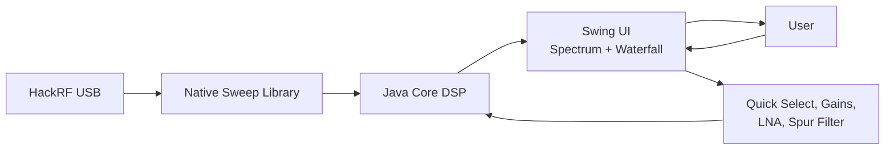

# Usage & Features

## Launching

After building:

```bash
make start
```

Or run the launcher directly from the build output:

```bash
./src/hackrf-sweep/build/hackrf-spectrum-analyzer/hackrf_sweep_spectrum_analyzer_linux.sh
```

On Windows the equivalent `.cmd` launcher is provided.

## Main Features



- **Real-time wideband sweeps** via integrated `hackrf_sweep` as a shared library.
- **Quick Select** buttons (this fork) for common bands:
  - WiFi 2 / WiFi 5
  - LTE bands
  - FM, HF, VHF, UHF, TV, NFC, etc.
- **Peak / Persistent / Waterfall** displays.
- **Spur filter** to remove artifacts from the HackRF.
- **Antenna LNA +14 dB** checkbox (enables the amplifier on the HackRF).
- Frequency allocation overlays (EU + USA).
- Easy retuning — all setting changes restart the sweep.

## Important Controls

- **LNA Gain / VGA Gain** — Analog gain stages.
- **FFT Bin** — Resolution bandwidth (minimum ~2445 Hz with current firmware).
- **Number of samples**
- **Antenna power** — Bias tee output.
- **Spur removal**
- **Persistent display** decay time
- **Waterfall** palette range

## Non-Interactive Mode

```bash
java -jar .../hackrf_sweep_spectrum_analyzer.jar capturegif
```

Originally intended for automated screenshot/GIF generation.

## Tips for HackRF Users

- Use a good USB cable and port (avoid hubs when possible).
- Keep the device cool during long runs.
- The "Spectrum updates stop on parameter change" issue is a known firmware quirk — press the reset button on the HackRF to recover.
- For best dynamic range, experiment with LNA/VGA settings and the LNA amplifier checkbox.

See [hackrf-setup.md](hackrf-setup.md) for hardware prerequisites.